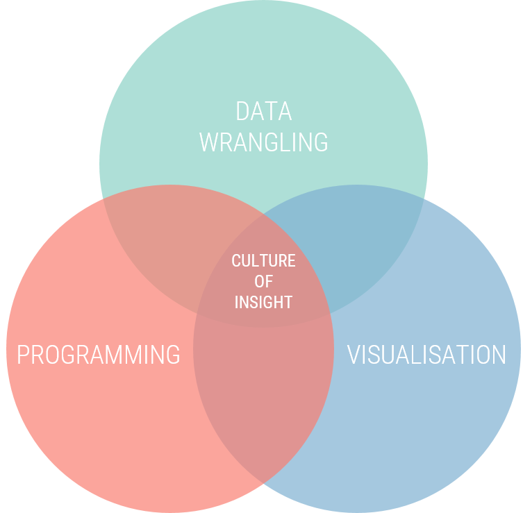

```{r setup, include=FALSE}
options(htmltools.dir.version = FALSE)
```

.left-column[
## Who are we?
]

.right-column[
- We are a data consultancy based in Islington, London with expertise in data wrangling and visualisation

- Since 2009 we've been helping some of the UK's top Media brands get the most out of their research data

<br>

<iframe src="https://www.blog.cultureofinsight.com/office_map/"
            width="100%" height="300" align="center" frameborder="no"></iframe>
]

---

.left-column[
## Who are we?
## What do we do?
]

.right-column[
- We develop tools for companies like yours to process and consume their data more efficiently

- This primary involves using computer programming to organise and clean data

- Then visualising it in automated reports of interactive web-applications
]

.center[

]

---

class: inverse, middle, center

# How could this help you?

---


