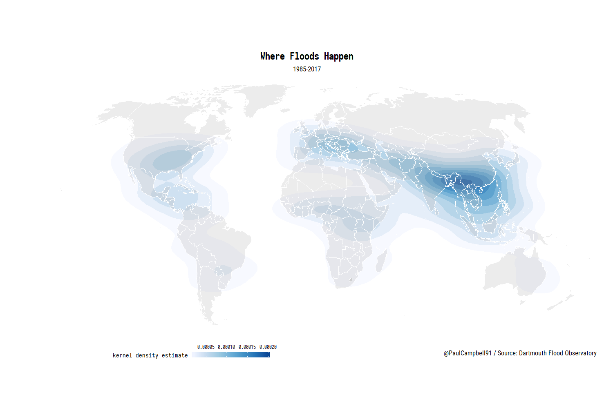

```{r setup, include=FALSE}
options(htmltools.dir.version = FALSE)

library(tidyverse)
library(plotly)
library(leaflet)
library(widgetframe)
library(waffle)
library(extrafont)
```

.left-column[
## Who are we?
]

.right-column[
- We are a data consultancy based in Islington, London with expertise in data wrangling and visualisation

- Since 2009 we've been helping some of the UK's top Media brands get the most out of their research data

<br>

<iframe src="https://www.blog.cultureofinsight.com/office_map/"
            width="100%" height="300" align="center" frameborder="no"></iframe>
]

---

.left-column[
## Who are we?
## What do we do?
]

.right-column[
- We develop tools for companies like yours to process and consume their data more efficiently

- This primary involves using computer programming to organise and clean data

- Then visualising it in automated reports of interactive web-applications
]

.center[

]

---

.left-column[
## Who are we?
## What do we do?
## How do we do it?
]

.right-column[


## We use R!

- R is a programming language built for *_data science_*

- Traditionally a tool for high-level statistical computing, R is now much more accessible and has become a brilliant tool for combining data analysis with visualistion, reports and web-applicaitons via the *Rmarkdown* and *Shiny* packages.

- The primary benefit is the ability to develop *reproducible workflows* when working with data, something that traditional spreadsheeting software falls short of

  .center[
  
  ]
]

---

class: inverse, middle, center

# How could this help you?

---

.left-column[
## Reproducible Reporting
]

.right-column[
- If your analysts spend a large chunk of their time making the same report each day/week/month, we can help.


- Excel is a great tool, but if you are repeating similar data tasks often, programming a script to handle the process for you will save time and reduce the chance of human error in your analysis.


- This will allow more time for analysts to consume and understand your data, rather than simply processing it.


- We can automate your data reporting process from data import through to final output, in any format you need it in:

  + Word
  + PowerPoint
  + PDF
  + HTML Webpage
  + Interactive Dashboard
]

---

class: inverse, middle, center

Here's an example outlining the benefits of a reproducible workflow...

<iframe width="560" height="315" src="https://www.youtube.com/embed/s3JldKoA0zw?autoplay=0" frameborder="0" allowfullscreen></iframe>

---

.left-column[
## Access to Data
]

.right-column[
- Too much data lies hidden in spreadsheets tabs or stale report documents. The proccess of accessing it can be so laborious that it is often overlooked. Considering how much we paid for the data, or how much is traded on it, that feels like a missed opportunity.

- To solve this problem for our clients, we build *engaging web-based user interfaces*, in which they can explore their data on a self-serving basis.

Something like the below...


]

---

.left-column[
## Bespoke Development
]

.right-column[
- Much of the data in the research industry does not easily fit into off-the-shelf BI platforms like Tableau

- Software licencing fees are expensive and also limit your ability to share your research with the wider world

- The flexibility of developing applications with open-source technologies allows us to build *targeted BI solutions* for our clients

- We meet the specific needs of a project and give you total control over who has access to it, be it a public facing website or a dashboard limited to a small team

- Working for clients predominantly in the Media Research industry, we have lots of knowledge and experience working with the data you will be familiar with, such as *Respondent Level Survey Data* or *Social Media Analytics*
]

---

.left-column[
## Better Data Visualisation
]

.right-column[

.center[

]

- More effective data visualisation has the ability to reveal patterns in your data you previously hadn't considered or knew existed

- We can build a diverse range of visualisations that will make your research stand out from the crowd

- From publication-quality static charts and maps with R's `ggplot2` package, to rich interactive experiences with javascript charting libraries such as `Plotly`, `Highcharts` and `Leaflet` maps

- Here are a few examples...
]

---
## Population Density by Ethnicity

<iframe width="100%" height="80%" src="https://www.blog.cultureofinsight.com/ldn_dotmap/" frameborder="0" allowfullscreen></iframe>

---

## House Prices - Animated Trends (press play)

<iframe width="100%" height="500px" src="plotly_animation.html" frameborder="0" allowfullscreen></iframe>

```{r eval=FALSE, message=FALSE, warning=FALSE, include=FALSE}

q <- readRDS("img/plotly_animation.rds")

quid <- scales::dollar_format("£")

p <- ggplotly(q, tooltip = c("text"))
#frameWidget(p, height = "500px")

htmlwidgets::saveWidget(frameableWidget(p),'plotly_animation.html')
```

---

## House Prices - Distributions

.center[

]
---

.left-column[
## House Prices - Bubbles
]

.right-column[

]

---

## Prem Goals (interactive)

<iframe width="100%" height="500px" src="prem_goal.html" frameborder="0" allowfullscreen></iframe>

```{r eval=FALSE, message=FALSE, warning=FALSE, include=FALSE}

p <- readRDS("img/prem_goals.rds") 
p <- p + facet_grid(. ~ `Scored/Conceded`)

p <- ggplotly(p, tooltip = c("y", "fill", "x")) #%>% 
  #frameWidget(width = "100%", height = "500px")

htmlwidgets::saveWidget(frameableWidget(p),'prem_goal.html')
```

---

## Global Flooding



---

## Trees in Paris (interactive) 

<iframe width="100%" height="500px" src="paris_leaflet.html" frameborder="0" allowfullscreen></iframe>

```{r eval=FALSE, message=FALSE, warning=FALSE, include=FALSE}

boundaries <- readRDS("img/paris_map.rds")
pal <- colorNumeric(palette = "viridis", domain = boundaries$`Per km2`)
tooltip <- paste0(boundaries$nom, "<br>Trees: ", boundaries$Total,
                  "<br>Per Square KM: ", round(boundaries$`Per km2`, 0)) %>% 
  lapply(htmltools::HTML)

p <- leaflet(boundaries) %>%
  setView(2.349014, 48.864716, zoom = 11) %>% 
  addProviderTiles(provider = "CartoDB.Positron") %>%
  addPolygons(fill = ~`Per km2`, fillColor = ~pal(`Per km2`), fillOpacity = .4,
              label = tooltip, stroke = FALSE, smoothFactor = 0) %>% 
  addLegend("topright", 
            pal = pal, 
            values = ~`Per km2`,
            title = "Trees per km2",
            opacity = 1) #%>% 
frameWidget(p)

htmlwidgets::saveWidget(frameableWidget(p),'paris_leaflet.html')
```

---

## Pie Chart Alternatives - Isotype Charts

.center[
```{r echo=FALSE, fig.height=5, fig.width=10, message=FALSE, warning=FALSE}
library(waffle)
library(extrafont)

p <- c(`I'm Loving this` = 4, `I'm intrigued\nby this R stuff` = 7, `I wish they'd stop\ntalking about R` = 32, `I wish this was\n a 3D Pie Chart` = 31, `I need a beer` = 26)

waffle(parts = p, rows = 5, title = "People viewing this slideshow", 
       use_glyph = "male", glyph_size = 11, legend_pos = "bottom", flip = F, reverse = F, colors = RColorBrewer::brewer.pal(5, "Dark2")) +
  theme(text=element_text(family="Roboto Condensed"), plot.background = element_rect(fill = "#f5f5f5", colour = "#f5f5f5"),
        legend.key = element_rect(fill = '#f5f5f5'), legend.text = element_text(size = 14))
```
]

---

## Thanks for watching!

If you'd like to see a bit more of what we do, you can peruse our data blog at your leisure here:

https://www.blog.cultureofinsight.com/

Or get in touch via the following channels:

- Email: [paul [at] cultureofinsight [dot] com](mailto:paul@cultureofinsight.com)

- Twitter [@datasetfree](https://twitter.com/datasetfree)

- Phone: 020 7502 5921

Enjoy the conference!

---

<div class="center">
  
  
</div>

.center[


]

